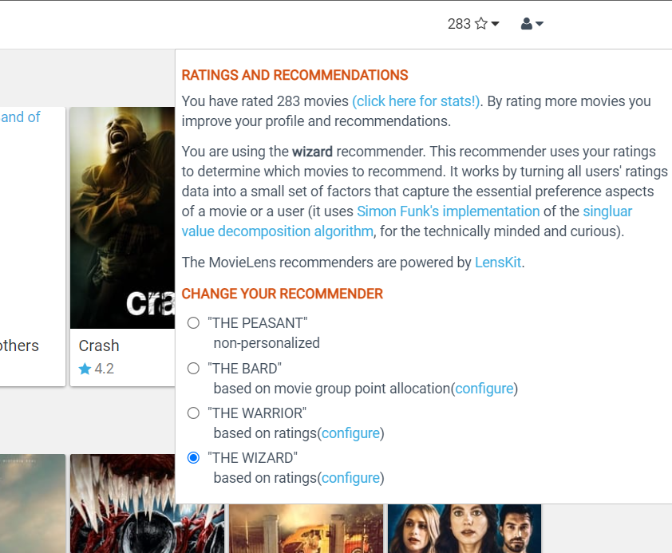

# Interactive recommender systems: a survey of the state of the art and future researchchallenges and opportunities

*Chen He, Denis Parra, Katrien Verbert*

La lectura de esta semana introduce el tópico de sistemas recomendadores interactivos. Básicamente estos hacen referencia a sistemas con los cuales los usuarios pueden interactuar más allá de solo asignar rating a items. Estos sistemas poseen un *framework* que despliega gráficos, tablas u otros elementos visuales que sirven para que las personas interactúen, comprendan y revisen el proceso de recomendación del sistema. Así, la lectura comienza haciendo un recuento de diversas técnicas de recomendación. Luego, los autores mencionan diferentes estructuras por medio de las cuales se pueden desplegar datos y los objetivos que cumplen estos *frameworks* en el proceso de recomendación de estos sistemas. Finalmente, se muestran y analizan paradigmas de sistemas recomendadores interactivos actuales.

Incluso antes de leer esta lectura, ya conocía los sistemas de recomendación interactiva, solo que no sabia que existia esta clasificación. Al inicio del curso, debido a los constantes ejemplos del profesor, decidí crearme una cuenta en la plataforma de MovieLens. Esta página web realiza recomendaciones de películas a sus usuarios en base al rating que ellos mismo entregan de films que ya han visualizado. Al tiempo de familiarizarme con la aplicación me di cuenta que tenía opciones que no esperaba en un sistema recomendador, como por ejemplo, permitir el tipo de recomendación que el usuario quiere recibir. Adjunto imagen de las personalizaciones que permite realizar la plataforma para generar las recomendaciones de los usuarios.

En este sentido y habiendo leído la lectura de esta semana puedo analizar las características de sistemas recomendadores interactivos que posee esta plataforma.

La primera característica que puedo señalar es la de Controlabilidad. Esta características corresponde a entregar a los usuarios la posibilidad de modificar el método de recomendación que se está utilizando para realizar las sugerencias. En la imagen anterior podemos notar en "CHANGE YOUR RECOMMENDER" las opciones de diferentes recomendadores, algunos personalizados y otros no personalizados.

La segunda característica que logré notar es la de Justificación del sistema. Esta característica corresponde a que un sistema explique cómo se están realizando las recomendaciones al usuario. En el caso de la imagen anterior se dice que el recomendador usado es *wizard* y que este realiza recomendaciones usando los rating que entrega el usuario, al parecer corresponde a la técnica de filtrado colaborativo. Debo mencionar que esta *feature* podría mejor desarrollada si se utilizan frameworks como gráficos, redes o tablas que colaboren en el entendimiento del método que se está utilizando, pero con la descripción cumple con la característica.
